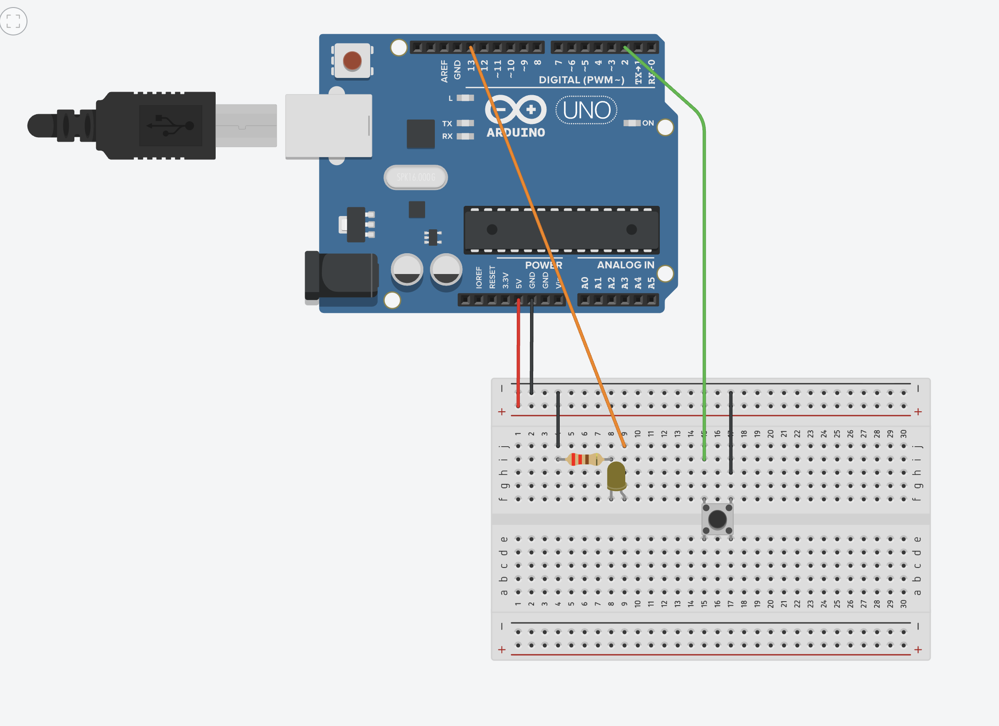

# Electronic Dice

Arduino controls LEDs based on the state of a pushbutton (pull-up). _The LED must turn ON when the button is pushed._

#### Required Material
- Arduino Uno (or similar)
- solderless breadboard
- one 220Ω resistor
- one pushbutton
- jumpers

## Exercice
The LED will turn ON while you have the finger on the button. 

1. Connecting a pushbutton to the Arduino (pull-up, see [pushbutton_pullup_deboucing](https://github.com/sergiomrebelo/fctuc-mdm-ti/tree/main/02-leds-and-pushbuttons/pushbutton_pullup_deboucing))
