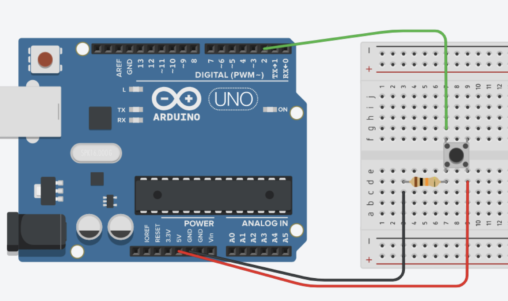

# Arduino & Friends: Going Further (Week 2)

Arduino controls LEDs based on the state of a pushbutton (pull-down). _The LED must turn ON when the button is pushed._

#### Required Material
- Arduino Uno (or similar)
- two LEDs
- solderless breadboard
- two 220Ω resistors
- one 10kΩ resistor
- one pushbutton
- jumpers

## Exercices
The LED will turn ON while you have the finger on the button. 

1. Connecting a pushbutton to the Arduino (see [Week2_Simple_Pushbutton_led](https://github.com/sergiomrebelo/fctuc-mdm-ti/tree/main/PL2-Pushbutton/Week2_Simple_Pushbutton_led))
2. Connecting a pushbutton to the Arduino, avoiding bouncing (see [Week2_Pushbutton_led_debouncing](https://github.com/sergiomrebelo/fctuc-mdm-ti/tree/main/PL2-Pushbutton/Week2_Pushbutton_led_debouncing))

## Challenge
Adapt the same circuit assembly to use two external LEDs connected to two different digital pins (e.g. 12 and 11). Make the LEDs flip alternately as the user presses the button.

[Solution](https://github.com/sergiomrebelo/fctuc-mdm-ti/tree/main/PL2-Pushbutton/Week2_Pushbutton_2_leds);